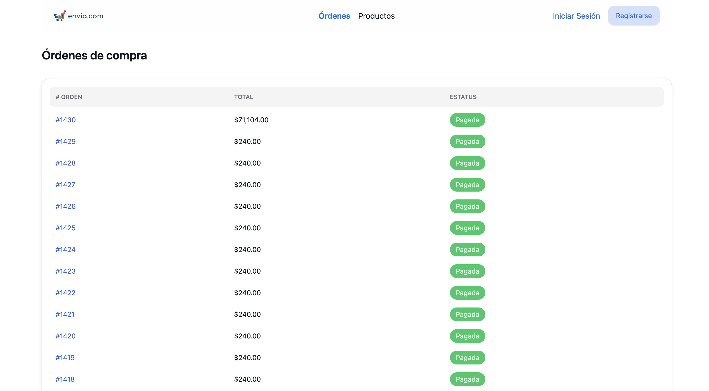
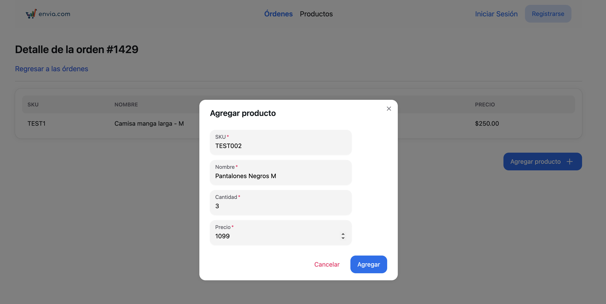
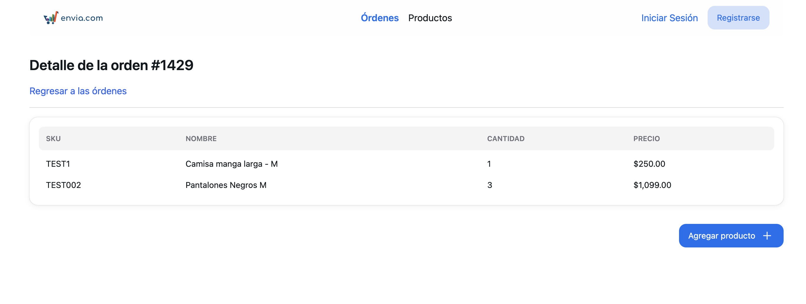
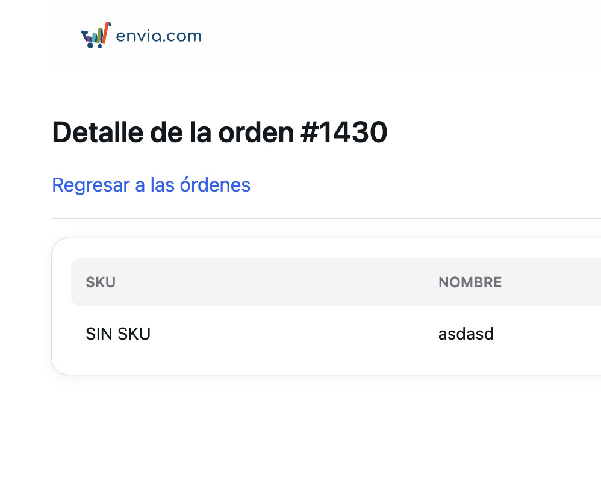

# Prueba Front End para Tendencys

Hola qué tal, esta es mi prueba de front end para Tendencys. A continuación explico algunas cosas que me encontré al desarrollar este proyecto.

## Instalación

1. Clonar el repositorio.
2. Instalar las dependencias con `npm install`.
3. Para ejecutar el proyecto de manera local usar el comando `npm run dev`, por defecto vite se ejecuta en la url `http://localhost:5173`

También hay un demo de mi proyecto en la siguiente url: https://65eb3a483b35eab0404be84a--clinquant-alfajores-dbd284.netlify.app/

## Tecnologías que utilicé

- React + Vite ya que me es más rápido trabajar con esas librerías
- Para el UI y componentes de diseño utilicé Tailwind CSS y NextUI.

## Consideraciones

- Al hacer la llamada a la API me percaté de que el producto de la primera orden no tiene SKU (venía como null) y le puse un condicional para que muestre "SIN SKU" para cualquier producto que venga así.

- Se puede hacer click en el número de orden para que se muestre el o los productos en otra tabla.
- Hice una función para que le de formato a los precios y los muestre como moneda.
- Consideré que poner todo en una sola página sería algo muy saturado y no tan fácil de navegar, así que usé el router de react para que muestre otra página de detalle de orden al hacer click desde el primer listado. Esto hace que lleve a una página con la url `/orders/{number}` pero para esta prueba no existe un endpoint en la API en donde se puedan consultar los items de una orden buscándola por su número, entonces envié los datos usando `location.state` para enviar el arreglo de items junto con el número de orden para poder mostrarlo en el título.
- Creé un custom hook llamado useFetch que hace llamadas a la API para poder usarlo en cualquier componente de ser necesario.
- Por práctica de seguridad estoy obteniendo el token de autorización desde un archivo `.env`
- Puse un navbar en la parte de arriba para que se vea más completo el diseño.
- Por cuestiones de tiempo no le agregué validaciones al formulario pero están disponibles en los componentes.
- Por cuestiones de tiempo tampoco puse un botón de pago pero igual pondría un modal como el del formulario.

## Muchas gracias

Agradezco el tiempo y la consideración a mi prueba de Front end. - Asael.
